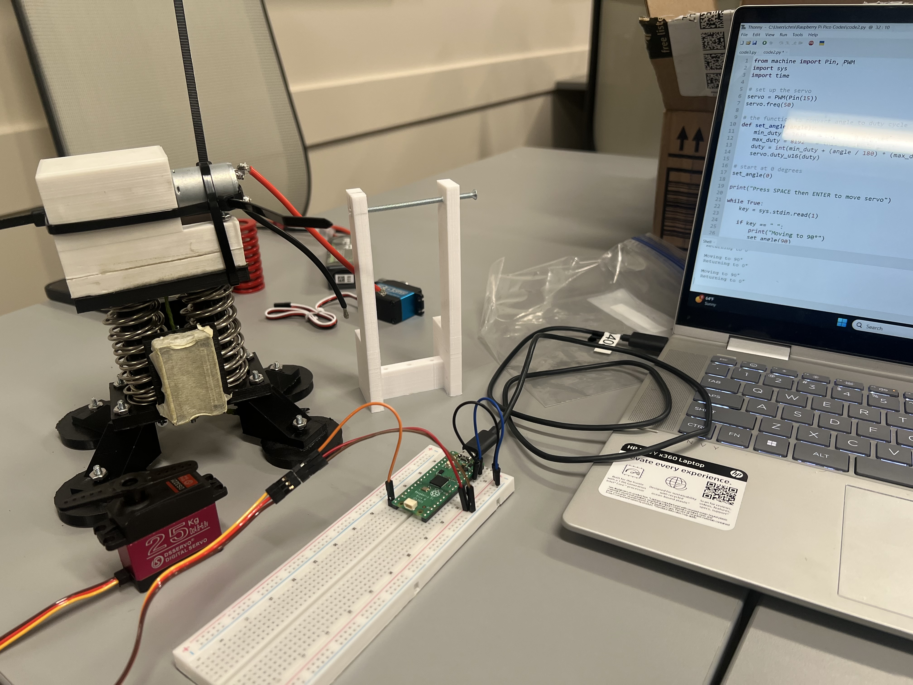

<!-- height or width of logo may be adjusted -->
<!-- This section is where you will replace the link to your transparent logo, the title of your project, and the very short desciptor of your project -->
<!-- If you used Canva to make your icon and don't want to pay for a background remover, you can use the website https://www.remove.bg/ to do so -->
<p align="center">
  
  <h1 align="center">Project Impulse</h1>
  <p align="center">A project for interested teens and young adults created by team TEC.</p>
</p>
<!-- the emojis are not set in stone! If you'd like you can remove them entirely or select your own from https://gist.github.com/rxaviers/7360908 you are welcome to -->

## About
<!-- You can look at other TAP projects if you need a better idea of how to describe your workshops objectives -->
<b>What participants will be doing:</b><br> During our workshop we are going to walk you through how to build a small AI-controlled circuit that works similarly to Project Impulse. 
## Project Information
<!-- 
Your Options for target audience: 
  - High School
  - College
  - Middle School
  - K-12
  - Non-Stem
  - Undergraduate
You can select from a range of audiences or a single auidience. Examples: 
    Middle School - College 
    High School - College
    K-12
  You will be presenting most often to your peers who are taking introductory technology classes, so more often than not you should be including college in your target audience range. 
-->
* <b>Difficulty Level:</b> Beginner
* <b>Target Audience:</b> College and High School
* <b>Duration of Workshop:</b> 1 hour - 1 hour and 30 minunte
* <b>Needed Materials:</b> Arduino Uno, Breadboard, LED Lights, Computer, Jumper Wires (two different colors), Resistor(s)
* <b>Learning Outcomes:</b> By teaching the basics of a simple circuit, we hope to inspire curiosity in robotics. 
Understanding how basic components like wires, batteries, and LEDs work together to create a functioning circuit can serve as a foundation for exploring more complex projects.
* <b>Main Technology:</b> Arduino IDE, is an intergrated development enviornment that is used to control the Arduino Uno, the brain of our workshop! 
* [Technology Ambassador Program](https://tapggc.org/) <b>(TAP)</b> is a project-based class that provides a collaborative environment for students to work with their fellow classmates on a semester-long project using technologies of their choice. TAP strives to increase participation in IT through numerous outreach activities and workshops that are designed to showcase the creative and fun side of technology.
<!-- Commercial Video stored in the Media folder will be linked here -->

[Commercial Video](https://github.com/user-attachments/assets/8944287a-ba6b-4001-a945-11a0633cc045)
<!-- videos can also be dragged and dropped into markdown files if you want them embedded -->

## Team: TEC

<!-- Use the team photo of your choice once youve uploaded it to the team photo folder within the media folder -->


> (From left to right: Christian Bacon,  Eyob Kabeto, Tia Best.)
<!-- replace with full names of your team members -->

* Tia Best
* Eyob Kabeto
* Christian Bacon

## Advisors
<!-- name of the two professors overseeing your TAP class -->
* Dr. Wei Jin
* Dr. Xin Xu


## Project Description
<!-- A more thorough description of your project. Not a full walkthrough, but describe the different sections of your project and the gist of what participants will be doing when interacting with it and what they'll learn. -->

&nbsp;&nbsp;&nbsp;&nbsp;Our project is centered around an Artificial Intelligence (Theta) that we built to control various forms of robotics. Impulse, our self built jumping robot, was the first instrument used to conduct our activities on. We were able to make the robot jump with simple commands given to our AI, Theta! We then attempted to use our AI to control pre built "MakeBlock Robots" which was also a success. For our ASF Demonstration, we used the now discontiued Cozmo Robots to navagate through a pre built maze in which also worked, giving AI the ability to control the robots motor functions, going left, right, forward and backwards! Our workshop consists of using this AI to control LED light circuts that the participants will be taught how to build. We hope to inspire those who find this intreresting to create or do something similar, rather it be creating their own AI, building their own robot, or both!

## Publications
<!-- team members, then professors/advisors. "Name of Publication", event, month and day, year, Georgia Gwinnett College. -->
1. Team Member, Team Member, Team Member, John Doe, Jane Doe. "A Real Fake Workshop", Fake Event, April 1, 2024, Georgia Gwinnett College.  

## Outreach
<ol>
  <li><b>TAP Expo</b>, March 6th, 2026, Georgia Gwinnett College: to promote the IT field and encourage college students to sign up for TAP.</li>
  <li><b>ASF @ Piedmont Park</b>, March 21st, 2026, Piedmont Park, Atlanta: to get childern and those in attencence involved and interested in technology.</li>
  <li><b>SST STaRS Event</b>, April 24th, 2026, Georgia Gwinnett College: an expo used to demonstrate the semester long projects of all student in attendence.</li>
  <li><b>Norcross Cluster Innovation Showcase</b>, April 25th, 2026, Downtown Norcross: an event we were invited to to showcase our project.</li>
  <li><b>The 26th CREATES Conference</b>, May 1st, 2026, Georgia Gwinnett College: an expo used to demonstrate the semester long projects of all student in attendence, similar to the STaRS Event just on a larger scale.</li>
</ol>

## Similar Projects
If you're interested in more workshops that utilize robotics, check out this <a href="https://tapggc.org/techs/sphero/">Sphero TAP Project!</a><br>
If you're interested in more workshops that utilize AI, check out this <a href="https://tapggc.org/projects/2025/spring/ai-diva/">AI Diva TAP Project!</a>

## Technology

 
* <b>Raspberry Pi Pico</b> – The Raspberry Pi Pico acts as the main controller for Project Impulse. It processes commands and controls the motors, servos, and sensors used throughout the robot.

* <b>BTS7960 Motor Driver</b> – The BTS7960 motor driver allows high-current control of the DC gear motor. This component gives the robot enough power to compress the springs used for jumping.

* <b>DC Gear Motor</b> – The DC gear motor is responsible for pulling and compressing the springs before launch. The gearing provides high torque for controlled movement and force.

* <b>Servo Motors</b> – Servo motors are used for mechanisms such as release systems and directional control. They allow precise movement during jumping and balancing actions.

* <b>Compression Springs</b> – Compression springs store mechanical energy which is released to launch the robot into the air. These springs are one of the main components that make jumping possible.

* <b>Limit Switches</b> – Limit switches help detect positions and movement limits within the robot. They improve safety and help automate the jumping sequence.

* <b>3D Printing</b> – Many custom parts of Project Impulse were designed and manufactured using 3D printing. This allowed our team to rapidly prototype parts and create lightweight custom structures for the robot.

* Our team selected these technologies because they combine robotics, mechanical engineering, electronics, and programming into one project. Together, these components allowed us to create an AI-assisted spring-powered jumping robot while giving participants hands-on exposure to real-world engineering concepts.

<p align="center">
  
</p>

## Project Setup / Installation

Before beginning the workshop, participants will first build a simple LED circuit and then connect it to the Delta AI system for interactive control.

---

### Understanding Your Tools: The Breadboard

A breadboard is a tool used to create temporary electronic circuits without soldering. It allows users to safely prototype and test circuits quickly.

#### Power Rails
The long vertical columns on the sides of the breadboard (usually marked with red `+` and blue `-`) are connected all the way down the board.

These rails distribute power throughout the circuit.

#### Terminal Strips
The horizontal rows in the center section are connected in groups of five.

For example:
* If a wire is plugged into row `1a`, it is electrically connected to:
  * `1b`
  * `1c`
  * `1d`
  * `1e`

This allows components to share electrical connections.

#### Center Divider
The gap running down the middle separates the left and right sides of the breadboard.

This helps isolate different sections of a circuit.

---

### Phase 1: Building the Circuit

#### Step 1 — Place the LED

Insert the LED into the breadboard.

**Important:**
* The **longer leg** is the:
  * Positive side (**Anode**)

* The **shorter leg** is the:
  * Negative side (**Cathode**)

 Correct LED orientation is required for the circuit to work properly.

---

#### Step 2 — Add the Resistor

Insert:
* One end of the resistor into the same row as the shorter LED leg.
* The other end into a different empty row.

The resistor limits electrical current and protects the LED from damage.

---

#### Step 3 — Create the Ground Connection

Take a **black jumper wire** and:

* Plug one end into the same row as the empty side of the resistor.
* Plug the other end into the:

```text
GND
```

pin on the Arduino Uno.

This completes the ground path of the circuit.

---

#### Step 4 — Initial Power Test

Take a **red jumper wire** and:

* Plug one end into the same row as the longer LED leg.
* Plug the other end into the:

```text
3.3V
```

pin on the Arduino Uno.

 If the LED lights up, your circuit was built correctly.

---

###  Phase 2: Opening the AI Software

#### Step 1 — Locate the Project Folder

Find the folder on your computer named:

```text
Delta
```

This folder contains the Delta AI assistant software used during the workshop.

---

#### Step 2 — Run the Startup Script

Inside the Delta folder, double-click:

```text
run_windows
```

This script automatically launches the Delta AI system.

---

#### Step 3 — Python Installation Check

Delta will automatically verify that Python is installed.

**If Python Is Missing**

A setup window will appear asking to install Python.

1. Click:

```text
Yes
```

2. When the installer opens:
   * Make sure to check:

```text
Add Python to PATH
```

3. Then click:

```text
Install Now
```

 Installation may take several minutes.

---

#### Step 4 — Wait for Delta to Initialize

Once installation finishes, Delta will launch automatically.

Wait until the terminal displays:

```text
Delta: System initialized. Hardware status: OK.
```

 This means Delta is connected and ready.

---

###  Phase 3: Switching to AI Control

Now you will transfer control of the LED from direct power to the Delta AI system.

---

#### Step 1 — Locate the Red Jumper Wire

Find the red jumper wire currently connected to:

```text
3.3V
```

on the Arduino Uno.

---

#### Step 2 — Move the Wire

Unplug the wire from `3.3V` and move it to:

```text
Pin 11 (GPIO 11)
```

on the Arduino Uno.

---

#### Step 3 — Observe the LED

The LED may temporarily turn off.

 This is normal because Delta is now waiting for commands.

---

###  Phase 4: Testing Delta

Once Delta is fully initialized, you can begin interacting with the AI assistant.

Try typing:

```text
Blink light fast
```

The LED should begin blinking rapidly, showing that Delta successfully controls the circuit.

---

#### Other Commands You Can Try

```text
Turn light on
```

```text
Turn light off
```

```text
Blink light slowly
```

```text
Let's run a scenario
```

Delta will process your commands and control the circuit in real time.

---

###  Learning Outcomes

By completing this workshop, participants will:

* Learn how simple electronic circuits function
* Understand how breadboards and LEDs work
* Gain experience using Arduino hardware
* Explore how AI systems interact with physical electronics
* Combine software, hardware, and robotics into one interactive project

<!-- if your project uses scratch, you can reuse any of these instructions (be sure to include CS First alternatives) -->
## Short Demo Instructions
[Project Impulse Demo Video](https://github.com/user-attachments/assets/da868057-6f41-49f5-872b-8d0f3eead35e)

This video demonstrates:
* How to build the LED circuit
* How to launch the Delta AI assistant
* How to connect the Arduino to AI control
* Example commands such as:
  * `Turn light on`
  * `Blink light fast`
  * `Turn light off`
---

## Workshop Instructions

[Click here to view the Workshop Walk Through](/documents/tutorial%20materials/workshop_walkthrough.docx)
